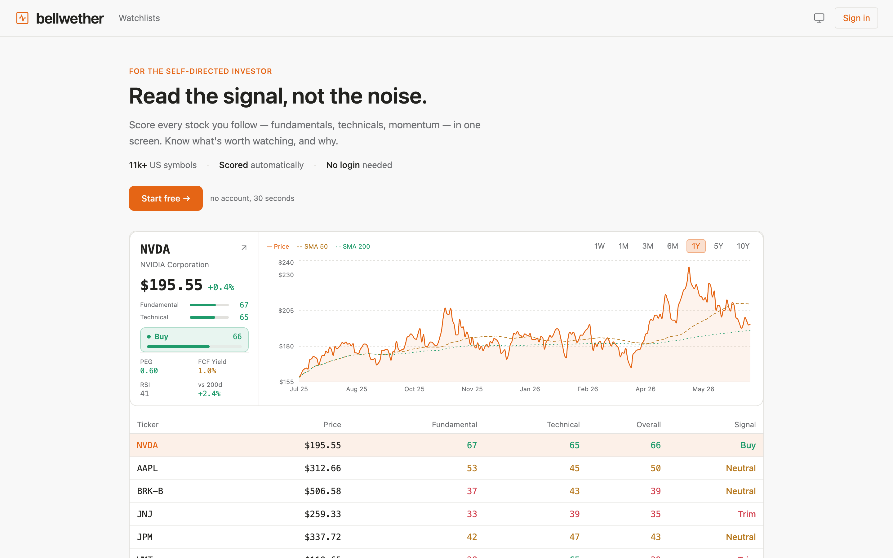
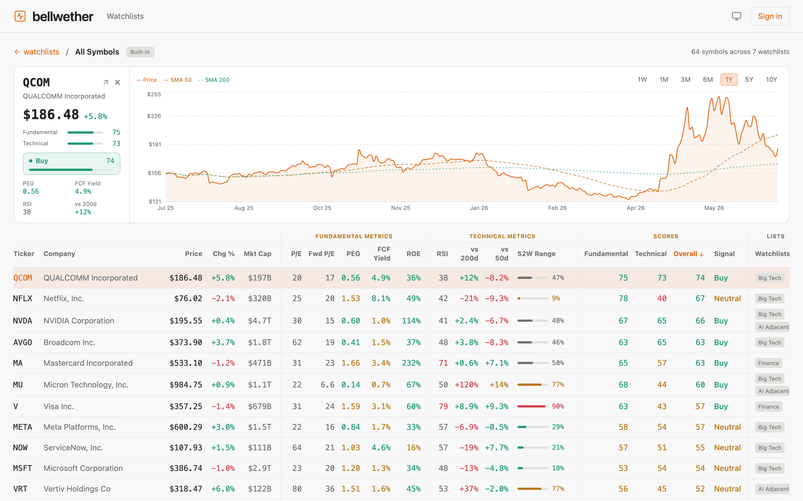
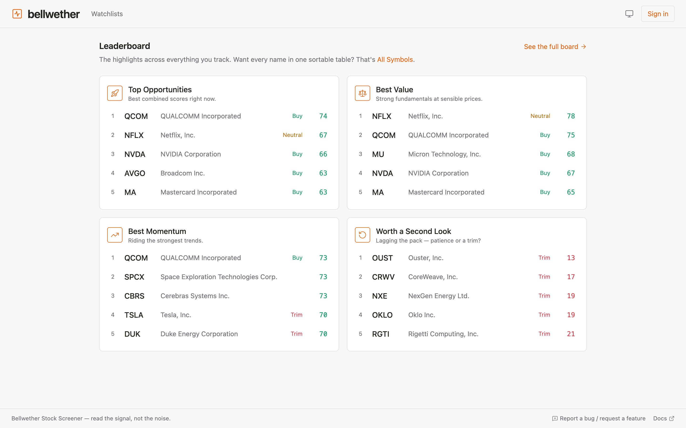

# Bellwether — read the signal, not the noise

**Score every stock you follow — fundamentals, technicals, momentum — in one
screen.** Bellwether is a multi-user stock dashboard, watchlist, and (soon)
discovery engine for the self-directed investor: every ticker you track gets a
transparent 0–100 score and a Buy / Neutral / Trim signal, so you know what's
worth your attention — and can check the math behind it.

## ▶ Try it live — no signup, no install

### **https://d29r5u77l543g9.cloudfront.net**

You're in instantly as a guest with your own private watchlists and a starter
list created for you. Want to keep your lists? Sign in — your guest data
migrates into the account automatically.

[](https://d29r5u77l543g9.cloudfront.net)

## Why it exists

Researching stocks yourself usually means five tabs: a quote page, a
fundamentals table, a chart, a screener, and a spreadsheet to make them agree.
Numbers everywhere, meaning nowhere. Bellwether folds that into one opinionated
view:

- **One score you can trust — because you can check it.** Fundamental (ROE, FCF
  yield, PEG) and Technical (RSI, SMA-50/200, 52-week range) sub-scores combine
  into an Overall score and signal. No black box: hover any column header for
  the exact inputs and weights ([docs/SCORING.md](docs/SCORING.md) has the full
  model).
- **Everything you track, one sortable table.** All Symbols consolidates every
  watchlist — 18 columns of scored, color-coded metrics, every column sortable,
  with an inline price + SMA chart on any row:



- **The leaderboard reads it for you.** Top opportunities, best value, best
  momentum, and "worth a second look" — ranked by the same scores you can
  verify:



## Feature rundown

**Live today:**
- **Watchlists** — create lists; add tickers with type-ahead autocomplete over
  11k+ US symbols, or paste several at once (`AAPL MSFT NVDA`); day-change %
  on every row.
- **All Symbols + Leaderboard** — the built-in views above.
- **Interactive charts** — price with SMA-50/200 overlays, 1W → 10Y, on every
  ticker.
- **Guest sessions** — full app, zero friction ([ADR-0009](docs/decisions/0009-guest-session-before-login.md));
  Cognito sign-in migrates guest data on first login.
- **Your account** — set how you're addressed; delete your account + data any
  time.

**Next:** discovery / screener — surface stocks *beyond* your watchlists,
ranked across a broad universe by configurable factors
([ADR-0003](docs/decisions/0003-discovery-engine.md)). Phase status:
[docs/roadmap.md](docs/roadmap.md) · item-level: [docs/backlog.md](docs/backlog.md).

**Deliberately out of scope:** portfolio tracking, brokerage integration,
automated trading.

## Quickstart (local, ~2 min)

**Prerequisites:** Python 3.9+, Node 18+, Git. No AWS account, no Docker, no
tokens — a demo user and starter watchlists are seeded automatically.

```bash
git clone https://github.com/unmiltambe/stock-screener.git
cd stock-screener
```

**Terminal 1 — backend (FastAPI, in-memory store, real market data):**
```bash
cd services
python3 -m venv .venv && source .venv/bin/activate
pip install -r requirements-dev.txt
DATA_BACKEND=yfinance uvicorn api.app:app --app-dir app --reload --port 8000
```

**Terminal 2 — frontend (React/Vite):**
```bash
cd apps/web
npm install
npm run dev
```

Open **http://localhost:5173**. Full options (offline fixture data, DynamoDB
Local, auth modes): [docs/local-dev.md](docs/local-dev.md).

## Architecture at a glance

API-first Python backend (FastAPI on AWS Lambda) + React/TypeScript SPA. In
production, **CloudFront serves the SPA and proxies the API on one origin** (no
CORS), backed by API Gateway → Lambda → DynamoDB, with Cognito JWT + guest
auth. Scale-to-zero by design — idle costs ~nothing.

```
Browser ──► CloudFront ──► S3 (SPA)
                └─ /v1/* ──► API Gateway ──► Lambda (FastAPI/Mangum) ──► DynamoDB
                                                │
   Cognito (JWT + guest sessions) ◄─────────────┘        yfinance (15-min cache)
```

The backend is hosting-agnostic: the same app also runs on Render as a
deliberate portability check ([ADR-0007](docs/decisions/0007-dual-deploy-portability.md)).
Scoring is pure Python with no framework imports, so it's trivially tested and
reused by the future batch screener. Full design: [docs/design.md](docs/design.md) ·
annotated tree: [docs/structure.md](docs/structure.md) · principles:
[docs/constitution.md](docs/constitution.md).

## Docs

[docs/README.md](docs/README.md) is the index with a reading order. Highlights:
the [constitution](docs/constitution.md) (10 design principles every PR is
checked against), [SCORING.md](docs/SCORING.md) (the frozen scoring model),
[screens.md](docs/screens.md) (per-screen UI spec), and 11
[ADRs](docs/decisions/) recording every significant decision with the
alternatives that were rejected. Changes follow
[docs/workflow.md](docs/workflow.md) — a change → verify → document → ship
checklist.

## Contributing

Contributions welcome — the codebase is deliberately approachable:

- **Pick something:** [docs/backlog.md](docs/backlog.md) lists captured-but-unbuilt
  items with context, open questions, and a rough approach for each. Open an
  issue first for anything larger than a small fix.
- **How to work here:** [AGENTS.md](AGENTS.md) (working style + guardrails) and
  [CONTRIBUTING.md](CONTRIBUTING.md) (process). CI runs tests + build on every PR.
- **Verify before you PR:** `cd services && pytest` and
  `cd apps/web && npm run build`.

Or skip the repo entirely — send feedback from the app via the **Report a bug /
request a feature** link in the footer.

## Live deployments

| Environment | URL | Role |
|------------|-----|------|
| **AWS CloudFront** | **https://d29r5u77l543g9.cloudfront.net** | **The app** — SPA + API, one origin (canonical) |
| AWS API Gateway | https://7x1e7unmh5.execute-api.us-east-1.amazonaws.com | Backend API direct (debugging) |
| Render | https://stock-screener-demo.onrender.com | Portability mirror (spins down on idle) |

Environment map: [docs/deployments.md](docs/deployments.md) · AWS runbook:
[docs/deploy-aws.md](docs/deploy-aws.md).

## Disclaimer

Bellwether is for **informational and educational purposes only** — nothing
here is financial, investment, or trading advice. Scores and signals are
algorithmic, based on delayed market data, and may be wrong. Do your own
research before making any investment decision.

## License

[MIT](LICENSE). This project is a greenfield rewrite of an earlier single-user
Streamlit prototype; the scoring model ([docs/SCORING.md](docs/SCORING.md)) is
carried forward, everything else was rebuilt for multi-user, scale-to-zero
cloud.
